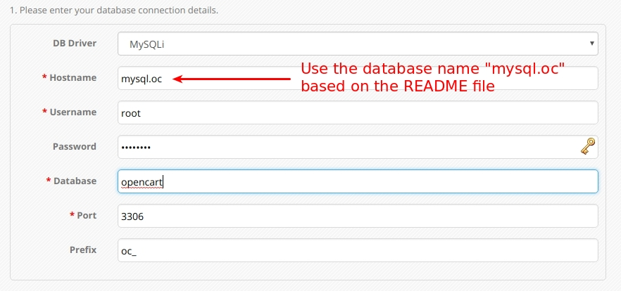
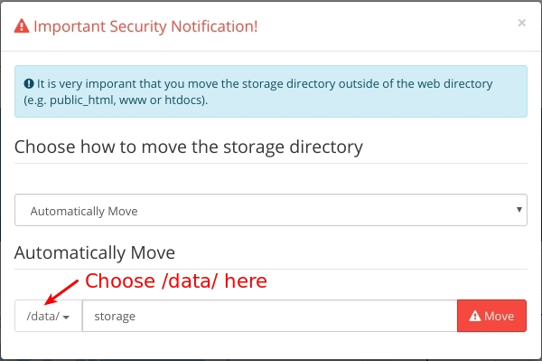

# Opencart Docker Image

[](http://opensource.byjg.com)
[](https://travis-ci.org/byjg/docker-opencart)

Opencart docker image prepared for production environment with volume persistent

Features:
- Persist volume with images and setup;
- Two images - one for install and other for running in production

# Tags

- Run Production Environment: byjg/opencart:3.0.2.0, byjg/opencart:lastest
- Run Installer (First time): byjg/opencart:3.0.2.0-installer

# Preparing Volume

Create a local directory to store your opencart data:

```bash
# Prepare the volume directory
mkdir ~/opencart
touch ~/opencart/config.php
touch ~/opencart/admin-config.php
sudo chown 65534:65534 -R ~/opencart

# Create a network
docker network create oc
```

# Running Opencart

After you setup the volume you can create the MySQL and the Opencart instance:

```bash
# Create a container mysql.
# Please do the necessary adjustments here
# More info: https://hub.docker.com/_/mysql
docker run -d --rm --name mysql \
     --network oc \
     -e MYSQL_ROOT_PASSWORD=password \
     -v ~/mysql-opencart:/var/lib/mysql \
     mysql:5.7

# Run the Opencart
docker run -d --rm --name opencart \
    --network oc \
    -p 80:80 \
    -v ~/opencart:/data \
    byjg/opencart:3.0.2.0-installer
```

The first time you'll be in the installation process. The database name should be `mysql.oc`. Just to understand, 
the `mysql` is the name of the container and `oc` is the network. 




After finish the install please access the admin area. You'll receive a "Important Security Notification". Please
choose "Automatically Move" to the directory "/data/" as you can see below:



OK. 

Now you won't lose your data saved in the opencart even if you stop and remove the containers. 

# Running in Production

Once you finish the setup and your store is running successfully you can stop the opencart and start a new container
from `byjg/opencart:3.0.2.0` with the same parameters above.

This container does not have the install folder, so you can just 

